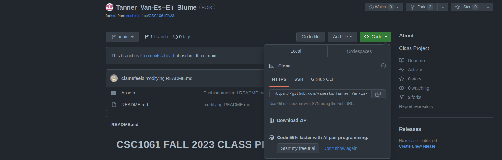
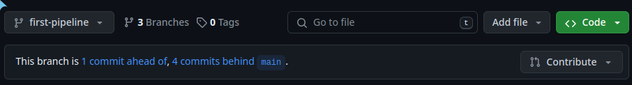
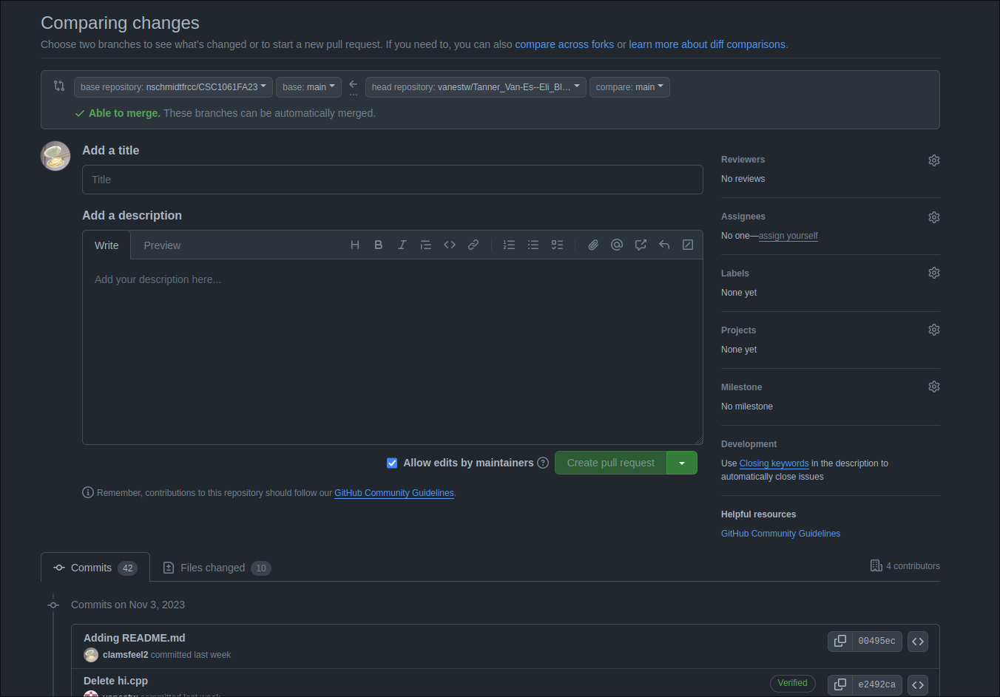
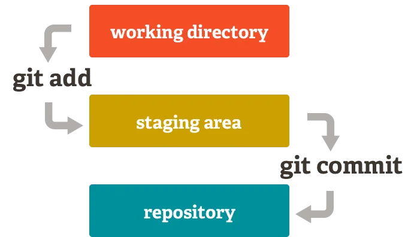
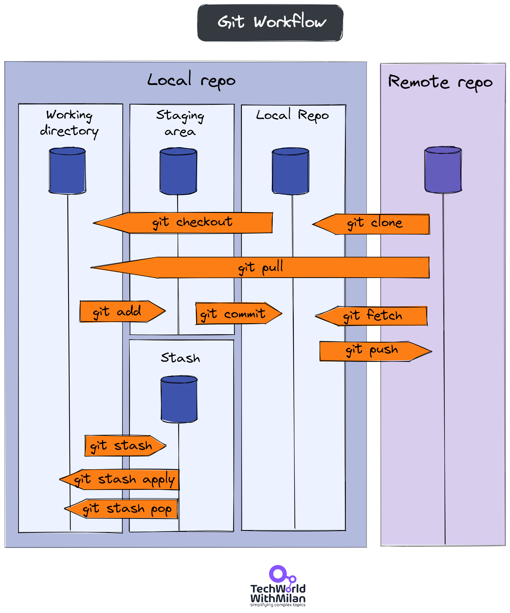

<div align="center">

# CSC1061 FALL 2023 CLASS PROJECT

</div>

### Topics Covered

[**Getting Started**](#getting-started)

[**Creating and Cloning Fork**](#creating-a-fork-of-the-main-repository)

[**Understanding and Working with Git**](#understanding-and-working-with-git)

[**Syncing Your Fork with the Main Repository**](#syncing-your-fork-with-the-main-repository)

[**Submitting Your Code**](#submitting-your-code)

[**Flowcharts to Help Visualization**](#flow-charts-to-help-visualize)

[**Extraneous Resources**](#extraneous-git-resources)

## Instructions

[***Click here if you are using your own device***](#using-personal-device)

*In this README we will be referring to PowerShell, but if you are using a Mac the instructions are the same in the terminal.*

**In order to access PowerShell, press the windows button on your keyboard and type in `Windows PowerShell`, press enter and you will be faced with a blue screen and command line.**

## Getting Started

Before we can create a new directory and clone the repository onto your machine, you must do two things.

1. Go to github.com and create an account.

2. Type the following commands into PowerShell:

```bash
git config --global user.email "your school email address"
git config --global user.name "your group members names"
```

## Cloning The Repository

Before we can do anything, we must clone a copy of the repository onto our machines. First, we can create a directory to clone the repo. Type the following into PowerShell or terminal:

```bash
mkdir ClassProject
cd ClassProject
```

That created a new directory named ClassProject which you will work out of. We need to clone a copy of our Git repository to work directly with it. To do that, press the following `code` button on the front page of the repo:



Ensure the `HTTPS` option is selected, then copy the link. The link should look something like this: 

```bash
https://github.com/nschmidtfrcc/CSC1061040SP24
```

Now reopen the PowerShell and type in this command:

```bash
git clone <the url you copied from your the repo>
```
## Creating a Branch in the Repository

After cloning the repository we need to make a branch for us to work on. Run the following command.

```bash
git checkout -b <group-name>
```
This will make a new branch in the repository and move you to it. <group-name> should be replaced with your group name with no whitespace (something like Tanner_Van-Es--Eli_Blume.)

***Some IDEs will prompt you when they detect that you are in a Git repository, and if you allow the IDE, it will help abstract some of these command-line commands and run them for you through the graphical user interface. Depending on the IDE the rest of the readme might not be applicable***

If you then type `ls` into PowerShell, you should see the name of the repository. Awesome!

Now you have a local copy of the codebase on your machine, and it can be opened via your favorite IDE; navigate to the ClassProject directory like you would any directory and start the project. You can now begin freely working on your code.

## Understanding and Working with Git

The beauty of Git is its ability to share and help *version* our code.

Three primary levels of Git are important to understand. The **local repository** (the cloned Fork in your ClassProjects directory), the **staging area** (intermediate reviewing step before committing and pushing to your remote repository), and the **remote repository** (your GitHub Fork).

The ***local repository*** (local repo)  is the copy of the repository on your machine (the repo we just cloned). The ***staging area*** is something we have yet to come across. After you have written some code, you can add the changes you have made to the staging area. The staging area allows the files you have changed to sit before you are ready to **commit** and **push** them into the remote repo, much like laying out the things you want to take on the bed before putting them in your suitcase. 

To add modified files into the staging area so they are ready for a commit, come back to your Terminal or PowerShell window and run:

```bash
git add <filenames>
```

You may also run:

```bash
git add .
```

The `.` refers to the current directory and will add every file within your current working directory to be tracked.

Next, type the following command in PowerShell:

```bash
git commit -m "Your commit message here"
```

It is essential that your commit message is concise and clearly explains what you have modified or added so one of your peers/group members can see what you have done. Treat your commit messages as seriously as you would inline comments.

**Committing should be done semi-frequently. If you have completed a section of code and successfully got it to compile and run, make a commit!!**

Finally, we can push our changes into the remote repository. To do so, run:

```bash
git push -u origin <branch-name> 
```
<branch-name> is the name of the branch that your group checked out earlier

## Syncing Your local repo with the Main Repository

At the start of each class you may want to sync your local repository with the main repository.

```bash
cd ClassProject
cd <repository name>
git pull
```

You must run `git pull` in order to sync any changes made from the remote repository into your local repository. You also must be inside of the directory containing the forked repository in order for the Git command to work.

**If you are using an IDE, there should be an option to run `git pull`**

## Submitting Your Code





If your group feels good about the code you have written and want to "submit" it, create a pull request. In order to do that first navigate to [repo](https://github.com/nschmidtfrcc/CSC1061040SP24) look for the `Branch` button in the top left and navigate to your branch. Next find the contribute button (as seen above). This will open a new screen:




A pull request is a way for you to request that your code be *pulled* into the main repository. As you can see, there is space for you to add a title and a description. Also note that at the bottom of the screen it shows all the commits and files changed that are apart of this pull request.

Once you write a sufficient title and add a description explaining your code press the `Create pull request` button. You have successfully created a pull request thread, in which the pull request lives. From this point your code will be reviewed and any discussion, changes, or announcements regarding that pull request will happen within the thread.

## Using Personal Device

***If you are using your personal device you will need to install Git onto your computer. The following instructions go though those steps.***

### Windows

On Windows, first install [Git](https://git-scm.com/download/win). Then open up the program Windows PowerShell.

### Mac

On Mac you will first need to install the Homebrew package manager. You can do so by opening the program Terminal and run this command:

```bash
/bin/bash -c "$(curl -fsSL https://raw.githubusercontent.com/Homebrew/install/HEAD/install.sh)"
```

[Learn more about Homebrew here](https://brew.sh/)

After Homebrew is installed, you need to install the Git package. To do so, just run the following command in PowerShell:

```homebrew
brew install git
```

[***Click here to return to instructions***](#getting-started)

## Flow Charts to Help Visualize

This is a very simple flowchart, but can help show what the `git add` and `git commit` commands are doing with your code:



This is a bit more complex, but shows more commands and what they are doing.

#### ***Ignore the entirety of `Stash`, it is not within the scope of this project.***



## Extraneous Git Resources

[Git Documentation](https://git-scm.com/doc)

[Git Cheatsheet](https://quickref.me/git)
